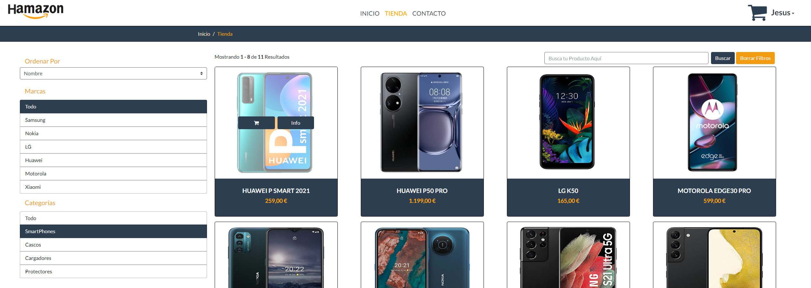
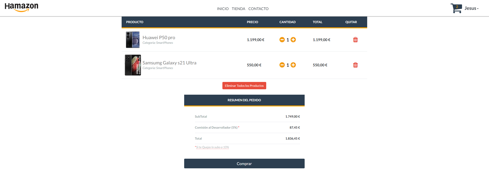
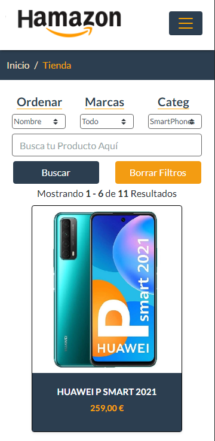
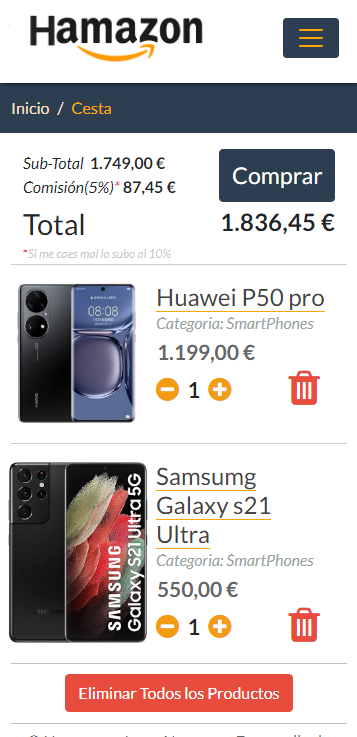

 <link href="readme_img/readme.css" rel="stylesheet"></link>

# Proyecto de Final de Ciclo DAW

  

## Aplicación web - Tienda de Artículos Electrónicos - Hamazon

  

  

## Tecnologías Utilizadas:

 1. ### Backend
 
   
 
   
    - ASP.NET Core v6
    
    - Swagger
    
    - Clean Arquitecture
    
    - Unit Testing (XUnit)
    
    - C# 

 2. ### Frontend
   
 
    
    - Angular v12
   
    - Servicios
    
    - Bootstrap
    
    - Routing
     
    - RXJS
    
    - TypeScript

  

 3. ### Despliegue:

   
 
    
    - Digital Ocean (Hosting)
   
    - Apache (ApyGateway)
    
    - CertBot (SSL)
     
    - Freenom

## Imagenes

  
  
  

  
  
  

