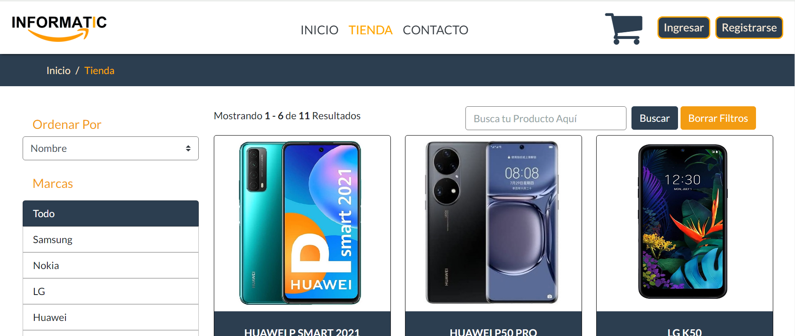
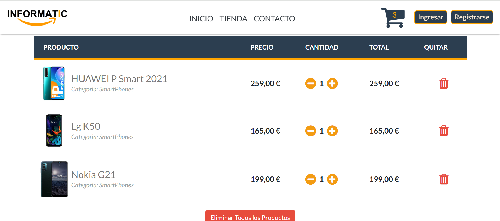
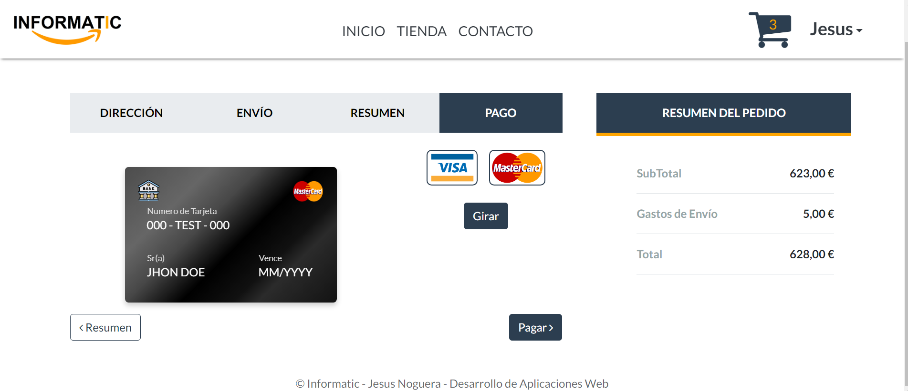
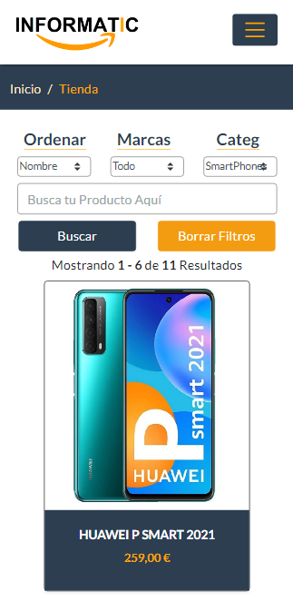
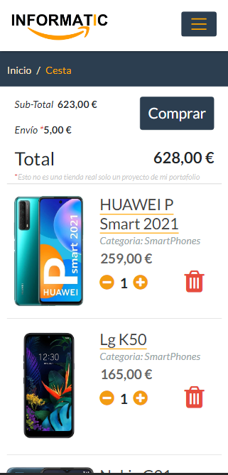
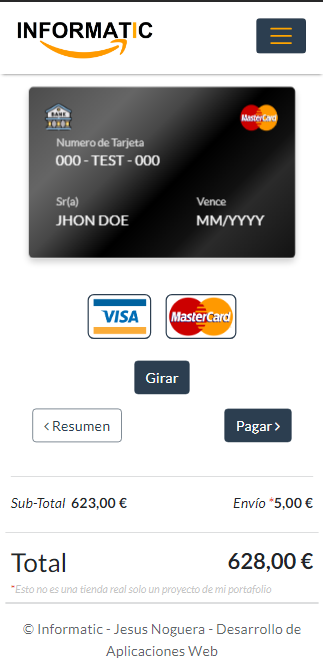

## Aplicación web - Tienda de Artículos Electrónicos - Informatic

  

  

## Tecnologías Utilizadas:

 1. ### Backend
 
   
 
   
    - ASP.NET Core v6

    - PostGreSQL

    - Redis 
    
    - Swagger
    
    - Clean Arquitecture
    
    - Unit Testing (XUnit)
    
    - C# 

 1. ### Frontend
   
 
    
    - Angular v12
   
    - Servicios
    
    - Bootstrap
    
    - Routing
     
    - RXJS
    
    - TypeScript

  
 3. ### Despliegue:

   
 
    
    - Firestore (AngularApp)
  
    - Neon (PostgreSQL ProductosDb - Usuarios Db)

    - RedisLab (RedisDb - ShoppingCart)

## Imágenes

  
  
  
  

  
  
  
  

